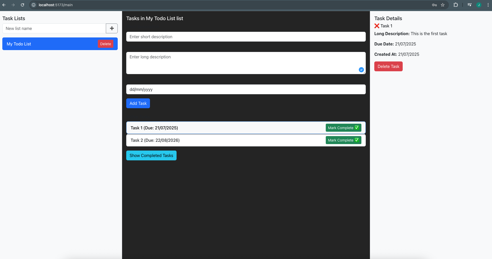

# TodoList Application

This is a full-stack TodoList application with a React frontend and a NestJS backend.

## Getting Started

Follow these instructions to set up and run the project locally.

### Prerequisites

Make sure you have the following installed:

*   Node.js (LTS version recommended)
*   npm or yarn
*   Git

### 1. Build the Types Package

First, navigate to the `types` directory and build the shared types package.

```bash
cd types
npm install
npm run build
cd ..
```

### 2. Set up and Run the Backend

Navigate to the `backend` directory, install dependencies, create the `.env` file, and start the backend server.

```bash
cd backend
npm install

# Create the .env file
# This file is crucial for storing sensitive information like your JWT secret.
# Replace `your_jwt_secret_key` with a strong, unique secret.
echo "JWT_SECRET=your_jwt_secret_key" > .env

# Create a jwt secret using Node with the command
node -e "console.log(require('crypto').randomBytes(32).toString('hex'))" 
# Replace the text "your_jwt_secret_key" by the newly generated random string 

npm run start:dev
```

The backend server will typically run on `http://localhost:3000`.

### 3. Set up and Run the Frontend

Open a new terminal, navigate to the `frontend` directory, install dependencies, and start the frontend development server.

```bash
cd frontend
npm install
npm run dev
```

The frontend application will typically run on `http://localhost:5173`.

### Project Structure

*   `backend/`: NestJS backend application.
*   `frontend/`: React frontend application.
*   `types/`: Shared TypeScript types and DTOs used by both frontend and backend.

## Demo

